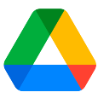

<MiniResourceCard slots="image,heading,text" repeat="3" theme="lightest" inRow="3" textColor="#424242" className="marketPlace inRow" />

## Google Drive

Share assets between Google Drive and your Adobe Express projects.

## Dropbox

Add Dropbox assets to your Adobe Express project, then save creative assets back to Dropbox.

## OneDrive

Bring assets to and from OneDrive to fuel your Adobe Express projects.
