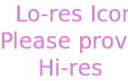

<MiniResourceCard slots="image,heading,text" repeat="3" theme="lightest" inRow="3" textColor="#424242" className="marketPlace inColumn" />

## Color Designer

Make generative background patterns using geometric shapes and tiling styles.

## OneDrive

Bring assets to and from OneDrive to fuel your Adobe Express projects.

## Spacefill

Make generative background patterns using geometric shapes and tiling styles.
