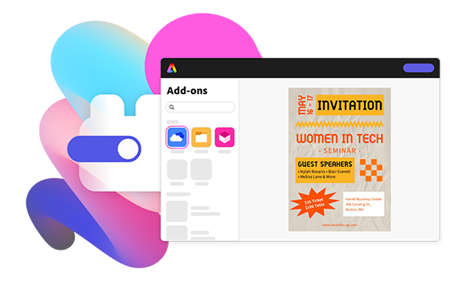
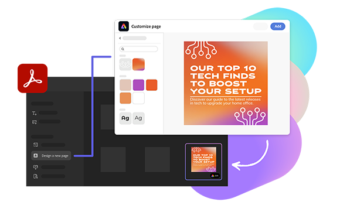

import './styles/main.css'
import bgImg from './images/summary-background.svg'
import DriveContent from './adobe-express/driveLanding.md'
import SpaceContent from './adobe-express/spaceAbility.md'

<Hero slots="heading, text, buttons, assetsImg" customLayout variant="halfwidth" className="add-ones-hero adobe-express-hero"/>

## Unlock creativity anywhere.

Build add-ons for <a href="https://express.adobe.com">Adobe Express</a> or embed Adobe Express features into your application. Learn more about:

- [Add-ons](/add-ons)
- [Embed SDK](https://developer.adobe.com/embed-sdk)

homeExpressLandingPage

<TextBlock slots="heading,text,image,buttons" theme="lightest" headerElementType="h2" variantsTypePrimary='secondary' variantStyleFill = "outline" homeZigZag className="explore unleash-power" position="left" />

### Extend the power of Adobe Express with add-ons.

Add-ons are applications that helps users add content to their pages, share their designs, and unlock their creative potential in new ways.

- [Learn more](https://adobe.io)
- [View Documentation](https://adobe.io)

<TextBlock slots="heading" className="announcement exploreCapabilities inspiration" theme="lightest"/>

### Get inspiration from the add-on marketplace.

<DriveContent />

<SpaceContent />
  
<TextBlock slots="heading,text,image,buttons" theme="light" headerElementType="h2" variantsTypePrimary='secondary' variantStyleFill = "outline" homeZigZag className="explore unleash-power" position="right" />

### Bring Adobe Express functionality to your users with the Embed SDK.

Give users of all skills levels the power to edit and create with access to thousands of templates, fonts, stock images, and videos.

- [Learn more](https://adobe.io)
- [View Documentation](https://adobe.io)
  
<TextBlock slots="heading" className="announcement exploreCapabilities" theme="light"/>

### We walk the talk.

<BoxModalBlock slots="image,heading,text,buttons" repeat="2" theme="light" bgColor="#f8f8f8" className="boxmodal" isCenter variantsTypePrimary='secondary'/>

## Dazzle within Adobe Acrobat.

The Adobe Express full editor allows users to create eye-catching cover and divider pages easily and quickly within Acrobat.

- [Learn more](https://adobe.io)

## Bring it on Creative Cloud desktop.

Launch the full suite of image and video editing quick actions in any Adobe application with Creative Cloud on desktop.

- [Learn more](https://adobe.io)

<TextBlock slots="heading" className="announcement exploreCapabilities support-label" theme="lightest"/>

### Support and resources are here for you.

<MiniResourceCard slots="image,heading" repeat="3" theme="lightest" inRow="3" className="mini-card support-tools" />

### Blog

### Add-on community

### Embed SDK forums

<TeaserBlock  slots="heading,text,buttons" textColor="white" bgURL={bgImg} className="viewAddOn creative-express" variant="fullwidth"/>

### Dive right in.

Explore which Adobe Express add-ons to build into your platform or learn more about the Adobe Express Embed SDK.

- [Add-ons](https://developer.adobe.com/express-add-ons)
- [Embed SDK](https://developer.adobe.com/embed-sdk)
